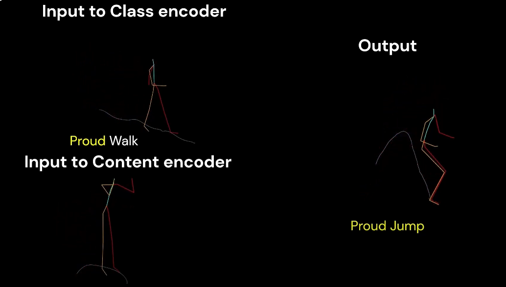
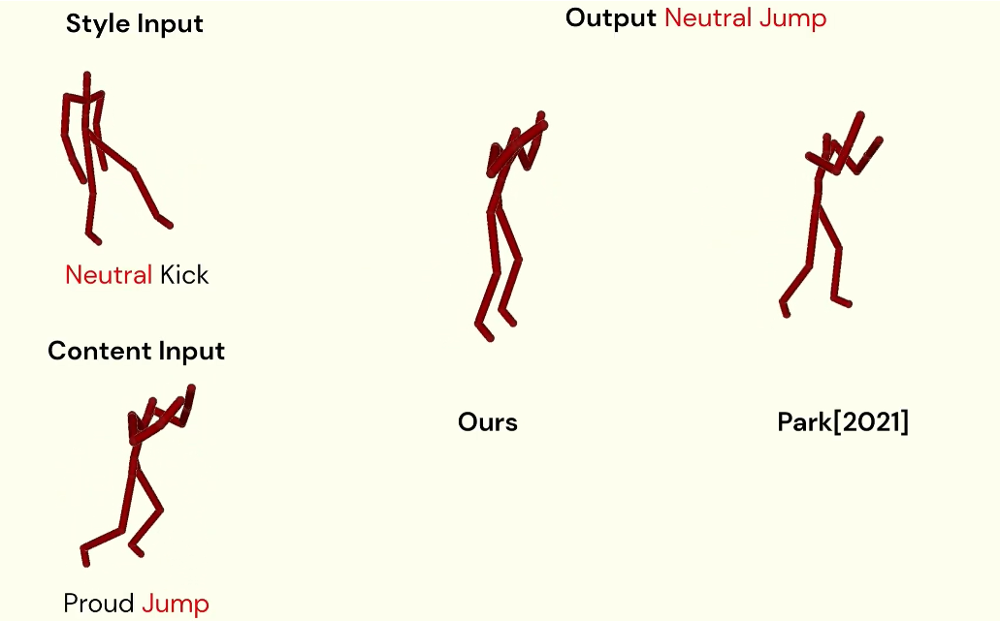

# D-LORD-for-motion-stylization
This is the official implementation of "D-LORD for Motion Stylization (IEEE TSMC-A  2024)" [[paper]](https://arxiv.org/abs/2412.04097)[[IEEE Link]](https://doi.org/10.1109/TSMC.2024.3502498)


## Results video
Click the figure to watch the teaser video. \
[](https://www.youtube.com/watch?v=7UtNGZjqmzI&t=12s)

[](https://www.youtube.com/watch?v=3u4qLg8hqWM)

## Code will be released soon

## Dependencies

We tested our code in the following environment:

- CUDA 11.8

- Python 3.8.10

### Requirements
* python >= 3.6
* numpy >= 1.15.4
* pytorch >= 1.3.0
* opencv >= 3.4.4
* dlib >= 19.17.0

## Installation
Clone this repository:
```
git clone https://github.com/Meenakshi1506/D-LORD-for-motion-stylization.git

cd D-LORD-for-motion-stylization
```
Install the dependencies:
```
pip install -r requirements.txt
``` 
  
## Citing
If you find this project useful for your research, please cite
```
@article{Gupta2024Dlord,
  author={Gupta, Meenakshi and Lei, Mingyuan and Cham, Tat-Jen and Lee, Hwee Kuan},
  journal={IEEE Transactions on Systems, Man, and Cybernetics: Systems}, 
  title={D-LORD for Motion Stylization}, 
  year={2024},
  volume={},
  number={},
  pages={1-14},
  doi={10.1109/TSMC.2024.3502498}}
```


